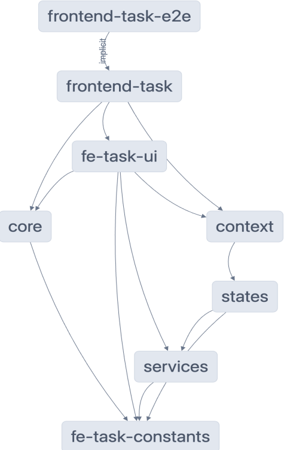

## Installation

```
yarn global add nx@latest
yarn
yarn start
```

for npm

```
npm add --global nx@latest
npm install
npm run start
```

## Tech Stack

This project was generated using [Nx](https://nx.dev) framework, which is a set of extensible dev tools for monorepos.

- [React](https://reactjs.org/)
- [EmotionJS](https://emotion.sh/docs/introduction)
- [TypeScript](https://www.typescriptlang.org/)
- [xstate](https://xstate.js.org/)
- [React-query](https://react-query.tanstack.com/)
- [axios](https://axios-http.com/)
- [material-ui](https://material-ui.com/)
- [nx.dev](https://nx.dev/)
- [jest](https://jestjs.io/)
- [cypress](https://www.cypress.io/)
- [eslint](https://eslint.org/)
- [prettier](https://prettier.io/)

## Structure

The application follows a monorepo structure using the Nx.Dev framework. This allows for better manageability and caching features, resulting in decreased building times. Circular dependencies among packages are also managed, with errors being thrown if any are detected.

### Packages

- **frontend-task**: This is the entry point of the application. It imports other components to serve the application.
- **fe-task-ui**: This package contains unique components that are specific to the frontend-task application.
- **core**: The core package contains mostly pure components that are not specific to any projects. These components are customizable and used in other packages.
- **context**: This package holds the application-specific context.
- **states**: Instead of using Redux or other state management libraries, this application utilizes a state machine implemented with xstate. This provides a more debug-friendly experience.
- **services**: All of the application's fetch requests are handled in this package. It implements react-query for its cache mechanism, using axios for the actual HTTP requests.

### Assumptions

It is assumed that there may be another projects which we would want to reuse
some components especially low level core components. So that, Nx.Dev
framework is used to have ability for monorepo. Each package is imported via
@fetask org prefix such as @fetask/core

### Structure Diagram


